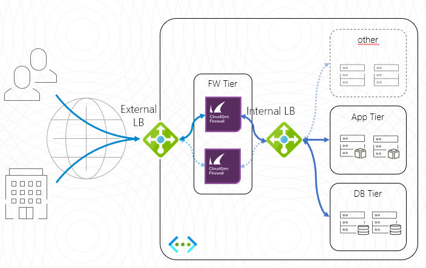

# Barracuda CloudGen Firewall Custom High Availability with Azure Standard Load Balancer

## Introduction
This Azure Resource Manager (ARM) template will deploy a cluster of Barracuda CloudGen Firewall virtual machines in an existing VNET. Deployment is done with in a one-armed fashion where north-south, east-west and VPN tunnel traffic can be intercepted and inspected based on the User Defined Routing that is attached to the subnets that need this control. Additionally this template will deploy a Azure Load Balancer with an external IP to direct the traffic to the active unit in the cluster. Do not apply any UDR to the subnet where the CGF is located that points back to the CGF. This will cause routing loops.

To adapt this deployment to your requirements you can modify the azuredeploy.paramters.json file and/or the deployment script in Powershell or Azure CLI (Bash).

## Prerequisites
The solution does a check of the template when you use the provide scripts. It does require that [Programmatic Deployment](https://azure.microsoft.com/en-us/blog/working-with-marketplace-images-on-azure-resource-manager/) is enabled for the Barracuda CloudGen Firewall BYOL or PAYG images. Barracuda recommends use of **D**, **D_v2**, **F** or newer series. 

You can enable programatic deployment via Powershell using the Cloud Shell feature in the portal. Below are two powershell examples for byol and hourly, please adapt as required to your version of powershell and byol or hourly license requirement.

`Get-AzRmMarketplaceTerms -Publisher "barracudanetworks" -Product "barracuda-ng-firewall" -Name "byol" | Set-AzureRmMarketplaceTerms -Accept`
`Get-AzureRmMarketplaceTerms -Publisher "barracudanetworks" -Product "barracuda-ng-firewall" -Name "hourly" | Set-AzureRmMarketplaceTerms -Accept`

It is not possible to connect the Azure Basic Load Balancer and the Azure Standard Load Balancer to the same VM or Availability Set. This is a limitation of the Azure Platform.

## Deployed resources
Following resources will be created by the template:
- One route table that will route all traffic for networks except for the internal networks to the CGF
- Two Virtual machines with a network interface and public IP in a Availability Set
- One external Azure Standard Load Balancer containing the deployed virtual machines with a public IP and services for IPSEC and TINA VPN tunnels available
- One internal Azure Standard Load Balancer containing the deployed virtual machines 1 load balancing rule directing all UDP and TCP traffic to the active firewall (HA Ports).

**Note** The backend subnets and resources are *not* automatically created by the template. This has to be done manually after template deployment has finished.

## Deployment

Deployment of the ARM template is possible via the Azure Portal, Powershell or Azure CLI. 
The package provides a deploy.ps1 and deploy.sh for Powershell or Azure CLI based deployments. This can be peformed from the Azure Portal as well as the any system that has either of these scripting infrastructures installed. Or you can deploy from the Azure Portal using the provided link.

### Azure Portal

To deploy via Azure Portal you can use the button below to deploy this reference architecture into your Azure subscription. Once you click on this the Azure Portal will ask you for your credentials and you are presented with a page to fill in minimal variables: Resource Group, Location, Admin password and Prefix.

### Azure CLI

To deploy via Azure Cloud Shell you can connect via the Azure Portal or directly to [https://shell.azure.com/](https://shell.azure.com/). 

- Start up Azure Cloud Shell from the Azure Portal or go directly to [https://shell.azure.com](https://shell.azure.com/)
- Download the latest version of the ARM templates in the persistant clouddrive:

`cd ~/clouddrive/ && wget -qO- https://github.com/barracudanetworks/ngf-azure-templates/archive/master.zip | jar xv && cd ~/clouddrive/ngf-azure-templates-master/CGF-Custom-HA-1NIC-AS-ELB-ILB-STD/ && ./deploy.sh`

- Answer the questions asked by the script on the following variables: location, prefix and password.

## Next Steps

Administration of the Barracuda CloudGen Firewall appliance is typically done with a Windows-based client application called as [Barracuda CloudGen Firewall Admin](https://dlportal.barracudanetworks.com/#/search).

Note: The username to login to the appliance is root and the password is the one you have configured on Azure portal while deploying the VM. Also a forward for TCP/807 and TCP-UDP/691 endpoints will be created automatically when you deploy this VM. Click here for more details.

Note: Please be patient on the latest 8.0.1 release provisioning may take a while and until it completes you will get "access denied" until this completes.If boot diagnostics is enabled you can view the log to monitor progress.

## Post Deployment Configuration

Starting with version 8.0 of the CGF you have a ILB probe rule called 'CLOUD-LB-PROBE' ready to go in the rulebase. You only need to activate it. You can also limit traffic to only come from the Microsoft Azure Virtual IP 168.63.129.16 for additional security.
In older version, you need to create manually a firewall *App Redirect* rule for ILB Probe traffic. The connection will use the port you indicated during template deployment and it will originate from 168.63.129.16 and can be redirected to any service running locally on NGF (e.g. 127.0.0.1:450 for firewall authentication service or 127.0.0.1:691 for NGF TINA VPN)

For more information on App Redirect rule consult Barracuda Campus: [How to Create an App Redirect Access Rule](https://campus.barracuda.com/product/nextgenfirewallf/article/NGF71/FWCreateAppRedirRule/)

It is also recommended you harden management access by enabling multifactor or key authentication and by restricting access to management interface using Management ACL: [How to Change the Root Password and Management ACL](https://campus.barracuda.com/product/nextgenfirewallf/article/NGF71/ChangeRootPWandMgmtACL/)

## Template Parameters
| Parameter Name | Description
|---|---
adminPassword | Password for the CloudGen Admin tool 
prefix | identifying prefix for all VM's being build. e.g WeProd would become WeProd-VM-CGF (Max 19 char, no spaces, [A-Za-z0-9]
vNetResourceGroup | Resource Group that contains the VNET where the CGF will be installed in
vNetName | The name of the VNET where the CGF will be installed in
subnetNameCGF | The name of the subnet where CGF will be installed
subnetPrefixCGF | Network range of the Subnet containing the CloudGen Firewall (e.g. 172.16.136.0/24)
imageSKU | SKU Hourly (PAYG) or BYOL (Bring your own license)
vmSize | Size of the VMs to be created
fwVMAddressA | Static IP Address of the first CGF VM in Azure
fwVMAddressB | Static IP Address of the second CGF VM in Azure
ccManaged | Is this instance managed via a CloudGen Control Center (Yes/No)
ccClusterName | The name of the cluster of this instance in the CloudGen Control Center
ccRangeId | The range location of this instance in the CloudGen Control Center
ccIpAddress | IP address of the CloudGen Control Center
ccSecret | Secret to retrieve the configuration from the CloudGen Control Center
