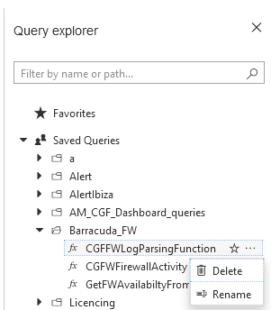

# Barracuda CloudGen Firewall for Azure - Log Analytics Workspace

## Introduction
The contents here are intended to improve the reporting avaialable for the Barracuda CloudGen Firewall in Azure.  They provide basic information on;

- VPN Status
- Firewall Performance
- Firewall Traffic

There are two deployment options now available. 
 - Solution Templates (Legacy for Log Analytics)
 - Workbooks (newest format)

Unless you have a reason not to, it is recommended to deploy the Workbook. 

These templates use the existing performance data provided to Log Analytics, for more detailed data follow the instructions under Additional Reporting.

The CloudGen Firewall can input into OMS any of it's logs via syslog and these can be used to create custom reports in further detail. 

## Prerequisites

1. For content to appear in any of these dashboards you must have connected your firewall to a Log Analytics workspace via Log Analytics > Virtual Machines, find your VM and select Connect. Alternatively follow Step 2 of (https://campus.barracuda.com/product/cloudgenfirewall/doc/79463434/how-to-configure-azure-oms-log-streaming/)

## Azure Sentinel Support
This template also includes saved searches required for Azure Sentinel Workbooks to function

## Additional Reporting
To benefit from the additional detail available in the firewall logs please complete the following steps. 

1. To enable detailed Firewall reporting, go to Configuration Tree > Infrastructure Services > General Firewall Configuration and change Activity Log Mode to "Log-Pipe-Seperated-Key-Value-List". 

Alternatively copy the contents of GeneralFirewallConfiguration.conf into you clipboard and Im/Export > Merge from Clipboard to update the fields.

2. To setup the additional Syslog Streaming go to Configuration Tree > Infrastructure Services > Syslog Streaming.If this box has connected to Log Analytics you should already a OMSSecurity Destination. 

You can point any of the available logs towards this destination, but the searches in this template are configured to analyse the following Log Groups therefore it is recommended to add these filters and send them to the OMS destination.
- Auth-All 
- Firewall-Activity-Only
- Config-All

To get these configured quickly, you can copy the contents of SyslogStreaming.conf into your clipboard and choose to Im/Export > Merge from Clipboard to create just those fields.

Otherwise;
* Create a New Logstream Destination named OMS and select Microsoft OMS from the Logstream Destination dropdown.
* Create the Logdata Filters, add 3 new filters one for each of the types listed above.
* Go to Logdata Streams and create a new stream associating the new OMS destination with the new Log Filters created above.

For more details on configuring these please see;

(https://campus.barracuda.com/product/cloudgenfirewall/doc/79463292/how-to-configure-syslog-streaming/?sl=AW7vcc5m7X_svXEFw7Ox&so=10)

## Deployment
### Azure Portal for Workbooks only

To manually deploya workbook via Azure Portal;

- Open https://portal.azure.com
- Navigate to Log Analytics workspaces
- Select your chosen workspace
- From the menu on the left, select Workbooks
- Create New
- Click on the Advanced Editor button 
- Open the  in Raw mode and copy and paste the contents between GitHub and the editor in the Azure portal
- Click on the Apply button. Click on the Advanced Editor button 

## Deployment of Azure Resource Manager Templates

Deployment of the ARM template (which includes the workbook) is possible via the Azure Portal, Powershell or Azure CLI. 

### Azure Portal

To deploy via Azure Portal you can use the button below to deploy this Log Analytics Dashboard into an existing Log Anayltics Workspace. Once you click on this the Azure Portal will ask you for your credentials and you are presented with a page to fill in minimal variables: Resource Group and Workspace name.

### Deploy New Workspace + Dashboards

 
## Troubleshooting

- If you have previously imported the Log Analytics template, you may receive a conflict for the SavedSearches which are already present.  You can delete these prior to importing via the Query Explorer in the Logs page of Log Analytics.  

##### DISCLAIMER: ALL OF THE SOURCE CODE ON THIS REPOSITORY IS PROVIDED "AS IS", WITHOUT WARRANTY OF ANY KIND, EXPRESS OR IMPLIED, INCLUDING BUT NOT LIMITED TO THE WARRANTIES OF MERCHANTABILITY, FITNESS FOR A PARTICULAR PURPOSE AND NONINFRINGEMENT. IN NO EVENT SHALL BARRACUDA BE LIABLE FOR ANY CLAIM, DAMAGES, OR OTHER LIABILITY, WHETHER IN AN ACTION OF CONTRACT, TORT OR OTHERWISE, ARISING FROM, OUT OF OR IN CONNECTION WITH THE SOURCE CODE. #####
