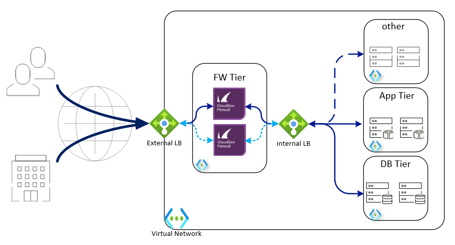
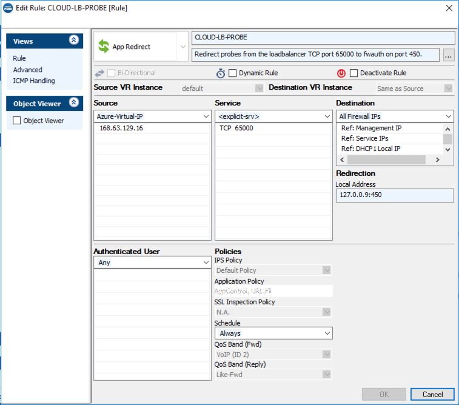

# Barracuda CloudGen Firewall for Azure - High Availability Cluster using Internal Load Balancer with Availability Zones

## Introduction

Traditionally, Barracuda CloudGen Firewall (CGF) uses UDR rewriting technique to redirect traffic when an HA failover happens. This method works well for smaller deployments, but has few drawbacks when using peered VNets or if corporate policy restricts saving AAD authentication keys in 3rd party software configuration.

Azure ILB solves above problems, providing failover capabilities with zero integration with the cloud fabric, offers shorter failover times (~15 seconds) independent of network complexity, and provides stateful failover.

This template deploys a VNet with 2 CGF instances with managed disks, an any-port ILB instance, and 2 empty subnets routed through CGF cluster.

## Prerequisites

The solution does a check of the template when you use the provide scripts. It does require that [Programmatic Deployment](https://azure.microsoft.com/en-us/blog/working-with-marketplace-images-on-azure-resource-manager/) is enabled for the Barracuda CloudGen Firewall F BYOL or PAYG images. Barracuda recommends use of **D**, **D_v2**, **F** or newer series. 

You can enable programatic deployment via Powershell using the Cloud Shell feature in the portal. Below are two powershell examples for byol and hourly, please adapt as required to your version of powershell and byol or cgf-hourly license requirement.

`Get-AzMarketplaceTerms -Publisher "barracudanetworks" -Product "barracuda-ng-firewall" -Name "byol" | Set-AzMarketplaceTerms -Accept`
`Get-AzureRmMarketplaceTerms -Publisher "barracudanetworks" -Product "barracuda-ng-firewall" -Name "cgf-hourly" | Set-AzureRmMarketplaceTerms -Accept`

This ARM template uses the Standard Load Balancer which is currently in preview. To enable this feature you need to run a couple of Powershell or Azure CLI 2.0 commands which can be found on the [Microsoft documentation page of this Standard Load Balancer](https://docs.microsoft.com/en-us/azure/load-balancer/load-balancer-standard-overview#preview-sign-up)

This ARM template also use Availability Zones which are in preview and available in a limited number of regions. To enable this feature in your subscription [click here](https://aka.ms/azenroll)

## Deployment

The package provides a deploy.ps1 and deploy.sh for Powershell or Azure CLI based deployments. This can be peformed from the Azure Portal as well as the any system that has either of these scripting infrastructures installed. Or you can deploy from the Azure Portal using the provided link.

## Deployed resources
Following resources will be created by the template:
- One Azure VNET with 3 subnets (1 for the CGF, additional subnets for a red and green subnet)
- Two route tables that will route all traffic for external and towards the other internal networks to the Barracuda CGF
- Once internal standard load balancer and one external public load balancer to provide full HA for the Barracuda CGF
- Two Barracuda CloudGen Firewall F virtual machines with a 2 network interfaces each and public IP
- This template uses 

**Note** Additional backend subnets and resources are *not* automatically created by the template. This has to be done manually after template deployment has finished or by adapting the ARM template.

## Next Steps

After successful deployment you can manage them using Firewall Admin application available from Barracuda Download Portal. Management IP addresses you'll find in firewall instances properties, username is *root* and the password is what you provided during template deployment.

## Post Deployment Configuration

You need to create manually a firewall *App Redirect* rule for ILB Probe traffic. The connection will use the port you indicated during template deployment and it will originate from 168.63.129.16 and can be redirected to any service running locally on CGF (e.g. 127.0.0.1:450 for firewall authentication service or 127.0.0.1:691 for CGF TINA VPN)

For more information on App Redirect rule consult Barracuda Campus: [How to Create an App Redirect Access Rule](https://campus.barracuda.com/doc/98210201/)

It is also recommended you harden management access by enabling multifactor or key authentication and by restricting access to management interface using Management ACL: [How to Change the Root Password and Management ACL](https://campus.barracuda.com/doc/98210587/)

## Template Parameters
| Parameter Name | Description
|---|---
adminPassword | Password for the CloudGen Admin tool 
prefix | identifying prefix for all VM's being build. e.g WeProd would become WeProd-VM-CGF (Max 19 char, no spaces, [A-Za-z0-9]
vNetAddressSpace | Network range of the VNET (e.g. 172.16.136.0/22)
subnetCGF | Network range of the subnet containing the CloudGen Firewall (e.g. 172.16.136.0/24)
subnetRed | Network range of the red subnet (e.g. 172.16.137.0/24)
subnetGreen | Network range of the green subnet (e.g. 172.16.138.0/24)
imageSKU | SKU Cgf-Hourly (PAYG) or BYOL (Bring your own license)
vmSize | Size of the VMs to be created
ccManaged | Is this instance managed via a CloudGen Control Center (Yes/No)
ccClusterName | The name of the cluster of this instance in the CloudGen Control Center
ccRangeId | The range location of this instance in the CloudGen Control Center
ccIpAddress | IP address of the CloudGen Control Center
ccSecret | Secret to retrieve the configuration from the CloudGen Control Center
