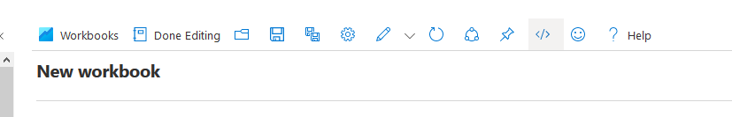
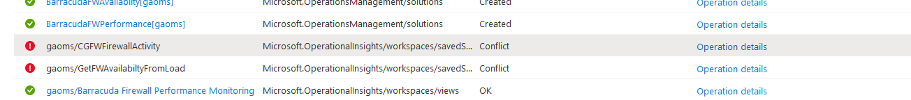

# Barracuda CloudGen Firewall for Azure - Log Analytics Workspace

## Introduction
The contents here are intended to improve the reporting avaialable for the Barracuda CloudGen WAN.  They provide basic information on;

- VPN Status
- Device Availabilty
- Device Performance
- Device Bandwidth
- WAN Latency

This template will deploy a workbook into a new or existing Log Analytics workspace

These templates use the existing performance data provided to Log Analytics, for more detailed data follow the instructions under Additional Reporting.

The CloudGen Firewall can input into OMS any of it's logs via syslog and these can be used to create custom reports in further detail. 

## Prerequisites

1. For content to appear in any of these dashboards you must have connected your solution to Log Analytics. You can do this by following the steps here: (https://campus.barracuda.com/product/cloudgenwan/doc/93192480/how-to-configure-log-streaming-to-microsoft-azure-log-analytics-workspace/)

## Azure Sentinel Support
TYou can also import the workbook into Azure Sentinel instead, this does not require Sentinel to function.

## Deployment
### Azure Portal for Workbooks only

To manually deploy a workbook via Azure Portal;

- Open https://portal.azure.com
- Navigate to Log Analytics workspaces
- Select your chosen workspace
- From the menu on the left, select Workbooks
- Create New
- Click on the Advanced Editor button 
- Open the  in Raw mode and copy and paste the contents between GitHub and the editor in the Azure portal
- Click on the Apply button. Click on the Advanced Editor button 

## Deployment of Azure Resource Manager Templates

Deployment of the ARM template (which includes the workbook) is possible via the Azure Portal, Powershell or Azure CLI. 

### Azure Portal

To deploy via Azure Portal you can use the button below to deploy this Log Analytics Dashboard into an existing Log Anayltics Workspace. Once you click on this the Azure Portal will ask you for your credentials and you are presented with a page to fill in minimal variables: Resource Group and Workspace name.

### Deployment

#### Quick Deploy

#### Manual Deploy
- In the Azure portal search for "Deploy a custom template"
- Build you own template in the editor
- Copy and Paste in the content of azuredeploy.json in Raw view.
- Save
- Then enter the required values to deploy into a resource group or deploy into a new or existing Log Analytics Workspace

## Troubleshooting

- If you have previously imported this Log Analytics template, you may receive a conflict for the SavedSearches which are already present.  You can delete these prior to importing via the Query Explorer in the Logs page of Log Analytics.  

##### DISCLAIMER: ALL OF THE SOURCE CODE ON THIS REPOSITORY IS PROVIDED "AS IS", WITHOUT WARRANTY OF ANY KIND, EXPRESS OR IMPLIED, INCLUDING BUT NOT LIMITED TO THE WARRANTIES OF MERCHANTABILITY, FITNESS FOR A PARTICULAR PURPOSE AND NONINFRINGEMENT. IN NO EVENT SHALL BARRACUDA BE LIABLE FOR ANY CLAIM, DAMAGES, OR OTHER LIABILITY, WHETHER IN AN ACTION OF CONTRACT, TORT OR OTHERWISE, ARISING FROM, OUT OF OR IN CONNECTION WITH THE SOURCE CODE. #####
