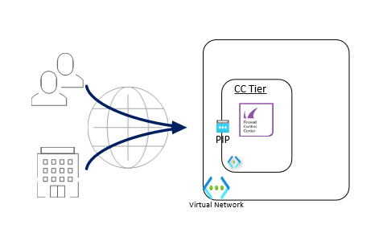

# Barracuda CloudGen Firewall Control Center 

**Note** This ARM Template will default to version 9.1 (and higher) of the Control Center. Version 9.1 is a cloud-only version. It is currently not available for on-premises deployments and can only be deployed in Microsoft Azure, Amazon Web Services, or Google Cloud Platform public clouds.

## Introduction

This template provides a template to deploy a Barracuda Control Center instance into an existing VNET. 

## Prerequisites

The VNET and subnet into which Control Center should deploy should already exist, these should be seperate from any existing firewalls so that routing can be applied.
The solution does a check of the template when you use the provided scripts.

This requires that [Programmatic Deployment](https://azure.microsoft.com/en-us/blog/working-with-marketplace-images-on-azure-resource-manager/) is enabled for the Barracuda CloudGen Control Center BYOL images. Barracuda recommends use of **D**, **D_v2**, **F** or newer series. For the automatic configuration using the REST API, Ansible is required. Ansible is deployed within the Azure Cloud Shell by default.

You can enable programatic deployment via Powershell using the Cloud Shell feature in the portal. Below are two powershell examples for byol and cgf-hourly, please adapt as required to your version of powershell and byol or cgf-hourly license requirement.

`Get-AzMarketplaceTerms -Publisher "barracudanetworks" -Product "barracuda-ng-cc " -Name "byol" | Set-AzMarketplaceTerms -Accept`

## Deployed resources

Following resources will be created by the template:
- One Barracuda Control Center instance

**Note** Additional routes into CC Management Networks and resources are *not* automatically created by the template. This has to be done manually after template deployment has finished or by adapting the ARM template.

## Deployment

The package provides a deploy.ps1 and deploy.sh for Powershell or Azure CLI based deployments. This can be peformed from the Azure Portal as well as the any system that has either of these scripting infrastructures installed. Or you can deploy from the Azure Portal using the provided link.

### Azure CLI

To deploy via Azure Cloud Shell you can connect via the Azure Portal or directly to [https://shell.azure.com/](https://shell.azure.com/). 

- Start up Azure Cloud Shell from the Azure Portal or go directly to [https://shell.azure.com](https://shell.azure.com/)
- Download the latest version of the ARM templates in the persistent clouddrive:

`cd ~/clouddrive/ && wget -qO- https://github.com/barracudanetworks/ngf-azure-templates/archive/master.zip | jar x && cd ~/clouddrive/ngf-azure-templates-master/Quickstart-CGF-VNET-Peering/ && ./deploy.sh`

- Answer the questions asked by the script on the following variables: location, prefix and password.

## Next Steps

Administration of the Barracuda CloudGen Control Center appliance is done with a Windows-based client application called as [Barracuda CloudGen Firewall Admin](https://dlportal.barracudanetworks.com/#/search).

Note: The username to login to the appliance is root and the password is the one configured during deployment. Also, a forward for TCP/807 and TCP-UDP/692 endpoints will be created automatically when you deploy this VM.

## Post Deployment Configuration

This configuration of the Barracuda CloudGen Control Center is handled by the Ansible configuration script after deployment using ARM templates. Below some steps to get you going after the deployment.

- License: By default the installation uses a BYOL installation. You can change the to PAYG by changing the "imageSKU" variable in the azuredeploy.parameters.json.
  - Request a demo license for a 30 day trial via [the Barracuda eval page](https://www.barracuda.com/download/products/)
  - THe license token (xxxxx-xxxxx-xxxxx) will be send by email. To activate the Barracuda CloudGen Control Center you can follow the instructions [here](https://campus.barracuda.com/doc/98210666/)
- Create access rules from extrenal networks to access the installed VM's. Make sure to only allow specific source IP's to access the VM's or setup a VPN
- Verify traffic is possible from the different networks 

It is also recommended you harden management access by enabling multifactor or key authentication and by restricting access to management interface using Management ACL: [How to Change the Root Password and Management ACL](https://campus.barracuda.com/doc/98210587/)

## Template Parameters
| Parameter Name | Description
|---|---
adminPassword | Password for the CloudGen Admin tool 
prefix | identifying prefix for all VM's being build. e.g WeProd would become WeProd-VM-CGF (Max 19 char, no spaces, [A-Za-z0-9]
vNetResourceGroup | Resource Group that contains the VNET where the CGF will be installed in
vNetName | The name of the VNET where the CGF will be installed in
subnetNameCC | The name of the subnet where CGF will be installed
subnetPrefixCC | Network range of the Subnet containing the CloudGen Firewall (e.g. 172.16.136.0/24)
imageVersion | Version of the Barracuda CloudGen Firewall
vmSize | Size of the VMs to be created
ipAddressCC | Static IP Address of the CGF VM in Azure

## Additional Resources

