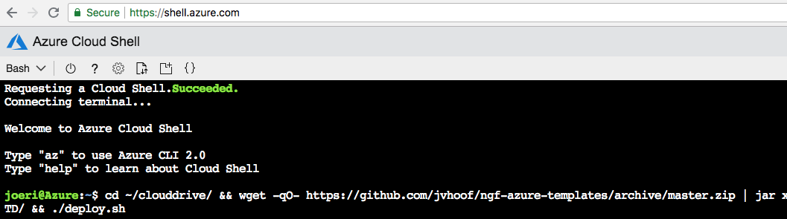

# Barracuda CloudGen Firewall for Azure - Secure Access Concentrator

## Introduction

This template is intended to provide a complete deployment of the required components for the IoT Secure Access Controller solution, to allow Azure to provide the central location for your IoT devices to connect into. 

This Barracuda Solution pack includes a Control Center for central management, a Secure Access Concentrator to handle the connections from the SC devices and a highly available pair of CloudGen Firewalls to handle security within the VNET. 

The Secure Access Concentrator requires the SC physical devices in order to be fully trialed as an IoT connectivity concentrator. You can request a 30 day evaluation device via:

Please complete the form here to arrange a trial for the physical devices. [IoT Trial](https://www.barracuda.com/products/cloudgenfirewall?scroll=lead-form)

## Prerequisites

The solution does a check of the template when you use the provided scripts. It does require that [Programmatic Deployment](https://azure.microsoft.com/en-us/blog/working-with-marketplace-images-on-azure-resource-manager/) is enabled for the Barracuda CloudGen Firewall BYOL or PAYG images and the Barracuda CloudGen Firewall Control Center BYOL images. Barracuda recommends use of **D**, **D_v2**, **F**  series as these have the best power to throughput ratios 

The template will also ask for the network ranges you wish your SC devices to use to connect into the SAC
This template will also ask for the network range you wish you Control Center to use to manage devices on.

It is not possible to connect the Azure Basic Load Balancer and the Azure Standard Load Balancer to the same VM or Availability Set. This is a limitation of the Azure Platform.

## Deployed resources

Following resources will be created by the template:
- Three Subnets into an existing VNET
- One internal standard Azure Load Balancer as the default gateway for all traffic that needs inspection
- One external standard Azure Load Balancer containing the deployed virtual machines with a public IP and services for IPSEC and TINA VPN tunnels available
- Two Barracuda CloudGen Firewall virtual machines with 1 network interface each and public IP
- Once Barracuda Control Center virtual machine with 1 network interface and one public IP
- One Barracuda Secure Access Concentrator virtual machine with 1 network interface and one public IP
- Three route tables
		- One attached to the Control Center subnet that points the SC network range at the SAC device
		- One attached to the SAC subnet that points the CC Management Network at the Control Center device
		- One attached to the FW subnet that points the FW at the CC for the CC Management Network range or the SAC for the SC Network.
		- One unattached as an example as what could be applied to other subnets to direct traffic through the Firewall and into the SC devices and down the Control Center management tunnels. 

- Both CGF systems are deployed in an Availability Set

**Note** Additional backend subnets and resources are *not* automatically created by the template. This has to be done manually after template deployment has finished or by adapting the ARM template.

## Deployment

Deployment of the ARM template is possible via the Azure Portal, Powershell or Azure CLI. 
The package provides a deploy.ps1 and deploy.sh for Powershell or Azure CLI based deployments. This can be peformed from the Azure Portal as well as the any system that has either of these scripting infrastructures installed. Or you can deploy from the Azure Portal using the provided link.

### Azure Portal

To deploy via Azure Portal you can use the button below to deploy this reference architecture into your Azure subscription. Once you click on this the Azure Portal will ask you for your credentials and you are presented with a page to fill in minimal variables: Resource Group, Location, Admin password and Prefix.

### Azure CLI

To deploy via Azure Cloud Shell you can connect via the Azure Portal or directly to [https://shell.azure.com/](https://shell.azure.com/). 

- Start up Azure Cloud Shell from the Azure Portal or go directly to [https://shell.azure.com](https://shell.azure.com/)
- Download the latest version of the ARM templates in the persistant clouddrive:

`cd ~/clouddrive/ && wget -qO- https://github.com/barracudanetworks/ngf-azure-templates/archive/master.zip | jar xv && cd ~/clouddrive/ngf-azure-templates-master/contrib/CGF-Custom-CC-SAC-CGF/ && ./deploy.sh`

- Answer the questions asked by the script on the following variables: location, prefix and password.

### Azure Powershell 

To deploy via Azure Cloud Shell you can connect to the Azure Cloud Shell via [https://shell.azure.com/](https://shell.azure.com/). 

- Start up Azure Cloud Shell from the Azure Portal or go directly to [https://shell.azure.com](https://shell.azure.com/)
- Download the latest version of the ARM templates in the persistant clouddrive:

`cd ~\clouddrive\; Invoke-WebRequest -Uri "https://github.com/barracudanetworks/ngf-azure-templates/archive/master.zip" -OutFile "~/clouddrive/master.zip"; jar xf master.zip; cd "~/clouddrive/ngf-azure-templates-master/contrib/CGF-Custom-CC-SAC-CGF/"; .\deploy.ps1`

- Answer the questions asked by the script on the following variables: location, prefix and password.

## Next Steps

Administration of the Barracuda CloudGen Firewall appliance is typically done with a Windows-based client application called as [Barracuda CloudGen Firewall Admin](https://dlportal.barracudanetworks.com/#/search).

Note: The username to login to the appliance is root and the password is the one you have configured on Azure portal while deploying the VM. Also a forward for TCP/807 and TCP-UDP/691 endpoints will be created automatically when you deploy this VM. Click here for more details.

## Post Deployment Configuration

Starting with version 8.0 of the CGF you have a ILB probe rule called 'CLOUD-LB-PROBE' ready to go in the rulebase. You only need to activate it. You can also limit traffic to only come from the Microsoft Azure Virtual IP 168.63.129.16 for additional security.
In older versions, you need to create manually a firewall *App Redirect* rule for ILB Probe traffic. The connection will use the port you indicated during template deployment and it will originate from 168.63.129.16 and can be redirected to any service running locally on NGF (e.g. 127.0.0.1:450 for firewall authentication service or 127.0.0.1:691 for NGF TINA VPN)

For more information on App Redirect rule consult Barracuda Campus: [How to Create an App Redirect Access Rule](https://campus.barracuda.com/product/cloudgenfirewall/doc/73719211/how-to-create-an-app-redirect-access-rule/)

It is also recommended you harden management access by enabling multifactor or key authentication and by restricting access to management interface using Management ACL: [How to Change the Root Password and Management ACL](https://campus.barracuda.com/product/cloudgenfirewall/doc/73719620/how-to-change-the-root-password-and-management-acl/)

## Template Parameters
| Parameter Name | Description
|---|---
adminPassword | Password for the Firewall Admin tool
prefix | identifying prefix for all VM's being build. e.g WeProd would become WeProd-VM-NGF (Max 19 char, no spaces, [A-Za-z0-9]
vNetResourceGroup | Network range of the VNET to be deployed into
vNetName | Name of the VNET to be deployed into
subnetCGF | Network range of the subnet containing the CloudGen Firewall (e.g. 172.16.136.0/24)
subnetCC | Network range of the Control Centers subnet e.g (172.16.138.0/25)
subnetSAC | Network range of the Secure Access Connectors subnet (e.g. 172.16.138.128/25)
imageSKU | SKU Hourly (PAYG) or BYOL (Bring your own license) for the Firewalls, CC and SAC will be BYOL
vmSize | Size of the VMs to be created - applies to all the boxes
subnetNameCGF | Name of the subnet to deploy the firewall into
subnetNameCC | Name of the subnet to deploy the Control Center into
subnetNameSAC | The name of the subnet to deploy the Secure Access Concentrator into
networkCCManagement | A network range that the Control Center will use for it's management network
networkCCManagement | A network range that the SC devices will operate on.
