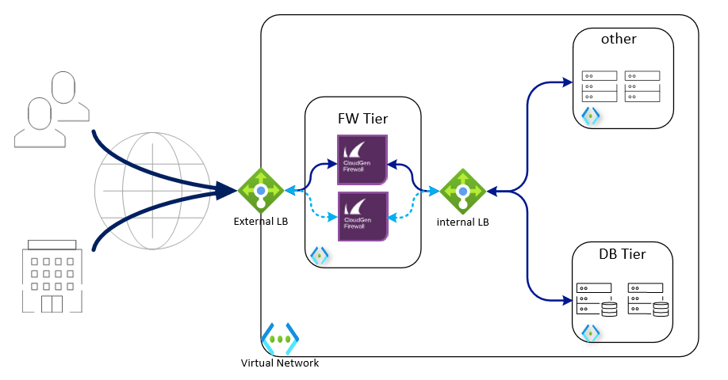

# Barracuda CloudGen Firewall for Azure - High Availability Cluster in an Availability Set using an Internal Standard Load Balancer

## Introduction

To provide high availability in the Azure platform a VM needs to use a Load Balancer or use the Cloud platform's rest api cloud integration to adapt the platform on failover. Since several years, the Barracuda CloudGen Firewall (CGF) uses cloud integration functionality to perform UDR rewriting to redirect traffic when an HA failover happens. This method works well for smaller deployments, but has few drawbacks when using peered VNets or if corporate policy restricts saving AAD authentication keys in 3rd party software configuration.

The Azure Standard Load Balancer solves the above problems, providing failover capabilities with no integration with the cloud fabric, offers shorter failover times (~15 seconds) independent of network complexity and provides stateful failover.

This template deploys a VNet with 2 CGF instances with managed disks, an any-port ILB instance, and 2 empty subnets routed through CGF cluster.

## Prerequisites

The solution does a check of the template when you use the provided scripts. It does require that [Programmatic Deployment](https://azure.microsoft.com/en-us/blog/working-with-marketplace-images-on-azure-resource-manager/) is enabled for the Barracuda CloudGen Firewall BYOL or PAYG images. Barracuda recommends use of **D**, **D_v2**, **F** or newer series. 

You can enable programatic deployment via Powershell using the Cloud Shell feature in the portal. Below are two powershell examples for byol and hourly, please adapt as required to your version of powershell and byol or hourly license requirement.

`Get-AzMarketplaceTerms -Publisher "barracudanetworks" -Product "barracuda-ng-firewall" -Name "byol" | Set-AzMarketplaceTerms -Accept`
`Get-AzureRmMarketplaceTerms -Publisher "barracudanetworks" -Product "barracuda-ng-firewall" -Name "hourly" | Set-AzureRmMarketplaceTerms -Accept`

It is not possible to connect the Azure Basic Load Balancer and the Azure Standard Load Balancer to the same VM or Availability Set. This is a limitation of the Azure Platform.

## Deployed resources

Following resources will be created by the template:
- One Azure VNET with 3 subnets (1 for the CGF, additional subnets for a red and green subnet)
- Two route tables that will route all traffic for external and towards the other internal networks to the Barracuda CGF
- One internal standard Azure Load Balancer as the default gateway for all traffic that needs inspection
- One external standard Azure Load Balancer containing the deployed virtual machines with a public IP and services for IPSEC and TINA VPN tunnels available
- Two Barracuda CloudGen Firewall virtual machines with 1 network interface each and public IP
- Both CGF systems are deployed in an Availability Set

**Note** Additional backend subnets and resources are *not* automatically created by the template. This has to be done manually after template deployment has finished or by adapting the ARM template.

## Deployment

Deployment of the ARM template is possible via the Azure Portal, Powershell or Azure CLI. 
The package provides a deploy.ps1 and deploy.sh for Powershell or Azure CLI based deployments. This can be peformed from the Azure Portal as well as the any system that has either of these scripting infrastructures installed. Or you can deploy from the Azure Portal using the provided link.

### Azure Portal

To deploy via Azure Portal you can use the button below to deploy this reference architecture into your Azure subscription. Once you click on this the Azure Portal will ask you for your credentials and you are presented with a page to fill in minimal variables: Resource Group, Location, Admin password and Prefix.

### Azure CLI

To deploy via Azure Cloud Shell you can connect via the Azure Portal or directly to [https://shell.azure.com/](https://shell.azure.com/). 

- Start up Azure Cloud Shell from the Azure Portal or go directly to [https://shell.azure.com](https://shell.azure.com/)
- Download the latest version of the ARM templates in the persistant clouddrive:

`cd ~/clouddrive/ && wget -qO- https://github.com/barracudanetworks/CGF-azure-templates/archive/master.zip | jar xv && cd ~/clouddrive/CGF-azure-templates-master/CGF-Quickstart-HA-1NIC-AS-ELB-ILB-STD/ && ./deploy.sh`

- Answer the questions asked by the script on the following variables: location, prefix and password.

### Azure Powershell 

To deploy via Azure Cloud Shell you can connect to the Azure Cloud Shell via [https://shell.azure.com/](https://shell.azure.com/). 

- Start up Azure Cloud Shell from the Azure Portal or go directly to [https://shell.azure.com](https://shell.azure.com/)
- Download the latest version of the ARM templates in the persistant clouddrive:

`cd ~\clouddrive\; Invoke-WebRequest -Uri "https://github.com/barracudanetworks/CGF-azure-templates/archive/master.zip" -OutFile "~/clouddrive/master.zip"; jar xf master.zip; cd "~/clouddrive/CGF-azure-templates-master/CGF-Quickstart-HA-1NIC-AS-ELB-ILB-STD/"; .\deploy.ps1`

- Answer the questions asked by the script on the following variables: location, prefix and password.

## Next Steps

Administration of the Barracuda CloudGen Firewall appliance is typically done with a Windows-based client application called as [Barracuda CloudGen Firewall Admin](https://dlportal.barracudanetworks.com/#/search).

Note: The username to login to the appliance is root and the password is the one you have configured on Azure portal while deploying the VM. Also a forward for TCP/807 and TCP-UDP/691 endpoints will be created automatically when you deploy this VM. Click here for more details.

## Post Deployment Configuration

Starting with version 8.0 of the CGF you have a ILB probe rule called 'CLOUD-LB-PROBE' ready to go in the rulebase. You only need to activate it. You can also limit traffic to only come from the Microsoft Azure Virtual IP 168.63.129.16 for additional security.
In older version, you need to create manually a firewall *App Redirect* rule for ILB Probe traffic. The connection will use the port you indicated during template deployment and it will originate from 168.63.129.16 and can be redirected to any service running locally on CGF (e.g. 127.0.0.1:450 for firewall authentication service or 127.0.0.1:691 for CGF TINA VPN)

For more information on App Redirect rule consult Barracuda Campus: [How to Create an App Redirect Access Rule](https://campus.barracuda.com/product/cloudgenfirewall/doc/96026195/)

It is also recommended you harden management access by enabling multifactor or key authentication and by restricting access to management interface using Management ACL: [How to Change the Root Password and Management ACL](https://campus.barracuda.com/product/cloudgenfirewall/doc/96026575/)

## Template Parameters
| Parameter Name | Description
|---|---
adminPassword | Password for the Firewall Admin tool
prefix | identifying prefix for all VM's being build. e.g WeProd would become WeProd-VM-CGF (Max 19 char, no spaces, [A-Za-z0-9]
vNetAddressSpace | Network range of the VNET (e.g. 172.16.136.0/22)
subnetCGF | Network range of the subnet containing the CloudGen Firewall (e.g. 172.16.136.0/24)
subnetRed | Network range of the red subnet (e.g. 172.16.137.0/24)
subnetGreen | Network range of the green subnet (e.g. 172.16.138.0/24)
imageSKU | SKU Hourly (PAYG) or BYOL (Bring your own license)
vmSize | Size of the VMs to be created
ccManaged | Is this instance managed via a CloudGen Firewall Control Center (Yes/No)
ccClusterName | The name of the cluster of this instance in the CloudGen Firewall Control Center
ccRangeId | The range location of this instance in the CloudGen Firewall Control Center
ccIpAddress | IP address of the CloudGen Firewall Control Center
ccSecret | Secret to retrieve the configuration from the CloudGen Firewall Control Center
