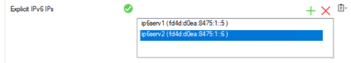

# Barracuda CloudGen Firewall Custom High Availability with Azure Standard Load Balancer and Availabilty Set with Dual Stack IPv6 Addressing Quickstart

## Introduction
This Azure Resource Manager (ARM) template will deploy a cluster of Barracuda CloudGen Firewall virtual machines in a new VNET. Deployment is done with in a one-armed fashion where north-south, east-west and VPN tunnel traffic can be intercepted and inspected based on the User Defined Routing that is attached to the subnets that need this control. Additionally this template will deploy a Azure Load Balancer with an external IP to direct the traffic to the active unit in the cluster. Do not apply any UDR to the subnet where the CGF is located that points back to the CGF. This will cause routing loops.

To adapt this deployment to your requirements you can modify the azuredeploy.paramters.json file and/or the deployment script in Powershell or Azure CLI (Bash).

## Prerequisites
The solution does a check of the template when you use the provided scripts. It does require that [Programmatic Deployment](https://azure.microsoft.com/en-us/blog/working-with-marketplace-images-on-azure-resource-manager/) is enabled for the Barracuda CloudGen Firewall BYOL or PAYG images. Barracuda recommends use of **D**, **D_v2**, **F** or newer series. 

You can enable programatic deployment via Powershell using the Cloud Shell feature in the portal. Below are two powershell examples for byol and hourly, please adapt as required to your version of powershell and byol or hourly license requirement.

`Get-AzMarketplaceTerms -Publisher "barracudanetworks" -Product "barracuda-ng-firewall" -Name "byol" | Set-AzMarketplaceTerms -Accept`
`Get-AzureRmMarketplaceTerms -Publisher "barracudanetworks" -Product "barracuda-ng-firewall" -Name "hourly" | Set-AzureRmMarketplaceTerms -Accept`

## Deployed resources
Following resources will be created by the template:
- An Azure VNET (*prefix*-VNET)
- Three Azure subnets: one for the CloudGen firewalls (*prefix*-SUBNET-CGF) and two for the backend servers (*prefix*-SUBNET-RED, *prefix*-SUBNET-GREEN)
- One Azure Standard External Load Balancer (*prefix*-ELB-CGF) with IPv4 PIP (*prefix*-CGF-LB-V4-PIP) and IPv6 PIP (*prefix*-CGF-LB-V6-PIP) used in the frontend configuration. The ELB is configured to use both the IPv4 and the IPv6 backend pools. The HA probe uses port 691 (probing the VPN service on the CloudGen Firewall).  The Load Balancing rules are either for IPv4 or IPv6, depending on requirement. In either case, the IPv4 LB rule must use the IPv4 frontend address and direct to the IPv4 backend pool; similarly, the IPv6 LB rule must use the IPv6 frontend address and direct traffic to the IPv6 backend.
- One Azure Standard Internal Load Balancer (*prefix*-ILB-CGF) with both an IPv4 and an IPv6 frontend configuration. The ILB is configured to use both the IPv4 and the IPv6 backend pools. The HA probe uses port 691. There are two Load Balancing rules, both making use of HA Ports,  one for IPv4 (using the frontend IPv4 address and the IPv4 backend pool) and one for IPv6 (using the frontend IPv6 address and the IPv6 backend pool)
- Two Azure route tables (*prefix*-RT-FOR-GREEN, *prefix*-RT-FOR-RED) to ensure the traffic is routed correctly via the firewall. These route tables are applied to the backend subnets by the template. The route tables should not be applied to the firewall subnet as a routing loop will result.
- Two Barracuda CloudGen Firewalls (*prefix*-VM-CGF-A, *prefix*-VM-CGF-B), each of which has a public IPv4 address and a public IPv6 address (for example the primary is configured with *prefix*-VM-CGF-A-PIP-V4, *prefix*-VM-CGF-A-PIP-V6). Other deployed resources for the firewalls is a single NIC per firewall (for example *prefix*-VM-CGF-A-NIC) and disk (*prefix*-VM-CGF-A-osdisk)
- Six Public IP addresses, 3 IPv4 and 3 IPv6

## Deployment

Deployment of the ARM template is possible via the Azure Portal, Powershell or Azure CLI. 
The package provides a deploy.ps1 and deploy.sh for Powershell or Azure CLI based deployments. This can be peformed from the Azure Portal as well as the any system that has either of these scripting infrastructures installed. Or you can deploy from the Azure Portal using the provided link.

### Azure Portal

To deploy via Azure Portal you can use the button below to deploy this reference architecture into your Azure subscription. Once you click on this the Azure Portal will ask you for your credentials and you are presented with a page to fill in minimal variables: Resource Group, Location, Admin password and Prefix.

### Azure CLI

To deploy via Azure Cloud Shell you can connect via the Azure Portal or directly to [https://shell.azure.com/](https://shell.azure.com/). 

- Start up Azure Cloud Shell from the Azure Portal or go directly to [https://shell.azure.com](https://shell.azure.com/)
- Download the latest version of the ARM templates in the persistant clouddrive:

`cd ~/clouddrive/ && wget -qO- https://github.com/barracudanetworks/ngf-azure-templates/archive/master.zip | jar xv && cd ~/clouddrive/ngf-azure-templates-master/CGF-Quickstart-HA-1NIC-AS-ELB-STD-IPV6/ && ./deploy.sh`

- Answer the questions asked by the script on the following variables: location, prefix and password.

## Next Steps

Administration of the Barracuda CloudGen Firewall appliance is typically done with a Windows-based client application called as [Barracuda CloudGen Firewall Admin](https://dlportal.barracudanetworks.com/#/search).

Note: The username to login to the appliance is root and the password is the one you have configured on Azure portal while deploying the VM. Also a forward for TCP/807 and TCP-UDP/691 endpoints will be created automatically when you deploy this VM. Click here for more details.

Note: Please be patient on the latest 8.3.0 release provisioning may take a while and until it completes you will get "access denied" until this completes. If boot diagnostics is enabled you can view the log to monitor progress.

## Post Deployment Configuration

Once the template has deployed, it should be possible to connect to the public IPv6 address of each firewall using Firewall Admin. However, to connect through the load balancer, some extra steps need to be taken. In order to access the firewalls through the Azure Load Balancer using IPv6, it is necessary to configure a service that will respond to the IPv6 probe packets issued by the Load Balancer. To complete configuration of this service, on the primary firewall, under Configuration Tree > Assigned Services > VPN > Service Properties > Explicit IPv6 IPs, Lock and then add the two Shared IPs which will appear in the dropdown. 

Ensure the cluster is licensed and the VPN service is running (the traffic will not be allowed to the firewall unless the VPN service returns the probe requests. IPv6 Traffic probes using IPv6 so the probed service must respond to IPv6 requests).

If IPv6 traffic requires routing between GREEN and RED subnets, add routes to the RED and GREEN route tables directing ::/0 traffic to the internal IPv6 IP of the ILB with the next hop type of Virtual Appliance. This will route IPv6 traffic to the firewall for inspection.

## Template Parameters
| Parameter Name | Description
|---|---
adminPassword | Password for the CloudGen Admin tool 
prefix | identifying prefix for all VM's being build. e.g WeProd would become WeProd-VM-CGF (Max 19 char, no spaces, [A-Za-z0-9] 
vNetAddressSpace | IPv4 Network Range of the VNet
VNetAddressSpacev6 | IPv6 Network Range of the VNet
subnetCGF | Network range of the Subnet containing the CloudGen Firewall (e.g. 172.16.136.0/24)
subnetRed | Network range of the red subnet (e.g. 172.16.137.0/24)
subnetGreen | Network range of the green subnet (e.g. 172.16.138.0/24)
subnetCgfv6 | IPv6 network range of the Subnet containing the NextGen Firewall (e.g. fd4d:d0ea:8475:1::/64)
subnetRedv6 | IPv6 network range of the red subnet (e.g. fd4d:d0ea:8475:2::/64)
subnetGreenv6 | IPv6 network range of the green subnet (e.g. fd4d:d0ea:8475:3::/64)
version |  Version of the Barracuda CloudGen Firewall to install"
imageSKU | SKU Hourly (PAYG) or BYOL (Bring your own license)
vmSize | Size of the VMs to be created
managedIdentity | Set to yes or no to enable managed identity
availabiltyType | Select Availabilty Zone or Availabilty Set