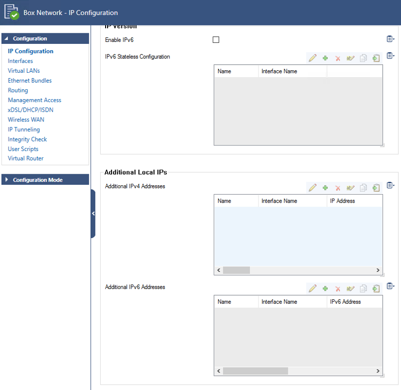
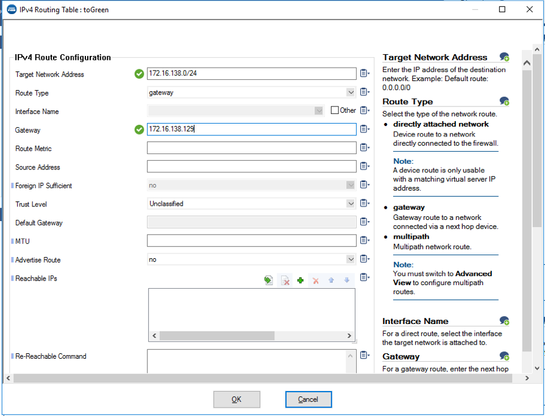
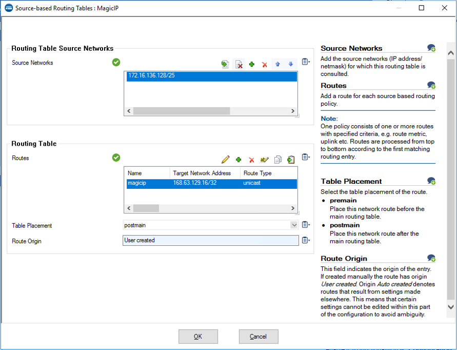

# Barracuda CloudGen Firewall for Azure - High Availability Cluster using Internal Load Balancer and in Availability Zones

## Introduction

Traditionally, Barracuda CloudGen Firewall (CGF) uses UDR rewriting technique to redirect traffic when an HA failover happens. This method works well for smaller deployments, but has few drawbacks when using peered VNets or if corporate policy restricts saving AAD authentication keys in 3rd party software configuration.

Azure ILB solves above problems, providing failover capabilities with zero integration with the cloud fabric, offers shorter failover times (~15 seconds) independent of network complexity, and provides stateful failover.

This template deploys a VNet with 2 CGF instances with managed disks, an any-port ILB instance, and 2 empty subnets routed through CGF cluster.

## Prerequisites

The solution does a check of the template when you use the provided scripts. It does require that [Programmatic Deployment](https://azure.microsoft.com/en-us/blog/working-with-marketplace-images-on-azure-resource-manager/) is enabled for the Barracuda Next Gen Firewall BYOL or PAYG images. Barracuda recommends use of **D**, **D_v2**, **F** or newer series. 

You can enable programatic deployment via Powershell using the Cloud Shell feature in the portal. Below are two powershell examples for byol and hourly, please adapt as required to your version of powershell and byol or hourly license requirement.

`Get-AzMarketplaceTerms -Publisher "barracudanetworks" -Product "barracuda-ng-firewall" -Name "byol" | Set-AzMarketplaceTerms -Accept`
`Get-AzureRmMarketplaceTerms -Publisher "barracudanetworks" -Product "barracuda-ng-firewall" -Name "cgf-hourly" | Set-AzureRmMarketplaceTerms -Accept`

## Deployment

The package provides a deploy.ps1 and deploy.sh for Powershell or Azure CLI based deployments. This can be peformed from the Azure Portal as well as the any system that has either of these scripting infrastructures installed. Or you can deploy from the Azure Portal using the provided link.

## Deployed resources
Following resources will be created by the template:
- One Azure VNET with 4 subnets (2 for the CGF, additional subnets for a red and green subnet)
- Two route tables that will route all traffic for external and towards the other internal networks to the Barracuda CGF
- One internal standard Azure Load Balancer as the default gateway for all traffic that needs inspection
- One external standard Azure Load Balancer containing the deployed virtual machines with a public IP and services for IPSEC and TINA VPN tunnels available
- Two Barracuda CloudGen Firewall virtual machines with 1 network interface each and public IP
- Both CGF systems are deployed in different Availability Zones

**Note** Additional backend subnets and resources are *not* automatically created by the template. This has to be done manually after template deployment has finished or by adapting the ARM template.

## Next Steps

After successful deployment you can manage them using CloudGen Admin application available from Barracuda Download Portal. Management IP addresses you'll find in firewall instances properties, username is *root* and the password is what you provided during template deployment.

## Post Deployment Configuration

### Networking

To activate the secondary interface you need to following certain steps. Also additional routing in the firewall is required to route the packets in the correct direction. 

- Firewall Admin > Configuration > Network > Interfaces and change the number of network interfaces to 2. After the activation you should see eth1 as an additional interface.  
  

- Firewall Admin > Configuration > Network > IP configuration > Additional Local IPs and add the private IP of the internal NIC in here linked to eth1.  
  

- Firewall Admin > Configuration > Network > Routing add the routing for the internal networks RED and GREEN towards the default gateway of the internal firewall subnet (172.16.136.129). 
  

- Firewall Admin > Configuration > Network > Routing add the source based routing for magic IP from Microsoft Azure that is used for the health probe of the Load Balancer. This ensures that probes towards the internal NIC will be responded by the internal NIC.  
  

- Firewall Admin > Control > Box > Activate new network configuration to enable all the network changes on the network layer of the firewall  
  
  

### Internal Load Balancer healthprobe

You need to create manually a firewall *App Redirect* rule for ILB Probe traffic. The connection will use the port you indicated during template deployment and it will originate from 168.63.129.16 and can be redirected to any service running locally on CGF (e.g. 127.0.0.1:450 for firewall authentication service or 127.0.0.1:691 for CGF TINA VPN)

For more information on App Redirect rule consult Barracuda Campus: [How to Create an App Redirect Access Rule](https://campus.barracuda.com/doc/98210201/)

It is also recommended you harden management access by enabling multifactor or key authentication and by restricting access to management interface using Management ACL: [How to Change the Root Password and Management ACL](https://campus.barracuda.com/doc/98210587/)

## Template Parameters
| Parameter Name | Description
|---|---
adminPassword | Password for the CloudGen Firewall Admin tool 
prefix | identifying prefix for all VM's being build. e.g WeProd would become WeProd-VM-CGF (Max 19 char, no spaces, [A-Za-z0-9]
vNetAddressSpace | Network range of the VNET (e.g. 172.16.136.0/22)
subnetCGF-external | Network range of the subnet containing the external CloudGen Firewall (e.g. 172.16.136.0/25)
subnetCGF-external | Network range of the subnet containing the internal CloudGen Firewall (e.g. 172.16.136.128/25)
subnetRed | Network range of the red subnet (e.g. 172.16.137.0/24)
subnetGreen | Network range of the green subnet (e.g. 172.16.138.0/24)
imageSKU | SKU Cgf-Hourly (PAYG) or BYOL (Bring your own license)
vmSize | Size of the VMs to be created
ccManaged | Is this instance managed via a CloudGen Control Center (Yes/No)
ccClusterName | The name of the cluster of this instance in the CloudGen Control Center
ccRangeId | The range location of this instance in the CloudGen Control Center
ccIpAddress | IP address of the CloudGen Control Center
ccSecret | Secret to retrieve the configuration from the CloudGen Control Center
